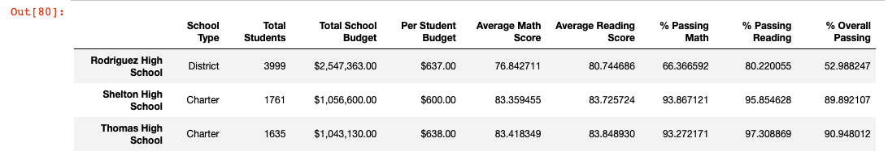

# School_District_Analysis

## Project Overview

A city school district needs help analyzing the standardized testing performance of the schools and students within its district. The analysis then needed to be updated to exlude the ninth grade students from Thomas High School because the school board found signs of academic dishonesty, and the grades for these students seemed to have been altered. The following was provided in the original analysis:

### District Summary
1. Total Number of Schools
2. Total Number of Students
3. Total School Budget of District
4. Average Math Score across District
5. Average Reading Score across District
6. % of Students in District Passing Math
7. % of Students in District Passing Reading
8. % of Students Overall Passing

### Schools Summary
1. School Type (District or Charter
2. Total Students per School
3. Total School Budget
4. Per Student Budget
5. Average Math Score
6. Average Reading Score
7. % Students Passing Math
8. % Students Passing Reading
9. % Students Overall Passing

### Specialized Analysis
1. Top Five Performing Schools
2. Bottom Five Performing Schools
3. Average Math and Reading Scores by Grade
4. Group Scores by School Spending per Student
5. Group Scores by School Size
6. Group Scores by School Type

Then this analysis was redone with the data from ninth graders at Thomas High School excluded from the analyzed dataset. 

## Resources
Data Sources: 
- [schools_complete.csv](Resources/schools_complete.csv)
- [students_complete.csv](Resources/students_complete.csv)

Software: Python 3.9.7, Pandas 1.3.4, Conda 4.11.0, Jupyter Notebooks, Visual Studio Code 1.64.2 (Universal)

## Results

**1. How is the district summary affected?**

The district summary changed very little after the ninth graders from Thomas High School were removed from the analysis. All measures besides the Average Reading Score were slightly lower (<1%) after the ninth graders were removed, while the Average Reading Score in the district didn't change at all. 

_Original District Summary (including Thomas HS 9th graders):_

_Revised District Summary (excluding Thomas HS 9th graders):_

**2. How is the school summary affected?**

The school summary also was minimally affected by taking out the performance data for ninth graders from Thomas High School. The changes to the math and reading scores were only noticeable at the tenth decimal in the summary scores.

_Original School Summary (including Thomas HS 9th graders):_

_Revised School Summary (excluding Thomas HS 9th graders):_

**3. How does replacing the ninth graders’ math and reading scores affect Thomas High School’s performance relative to the other schools?**

Removing the scores of Thomas HS ninth graders had no effect on the high school's performance ranking compared to other schools. Thomas High School remained the second highest performing school in the district. 

_Top Five Performing Schools List_

**4. Math and reading scores by grade**

The ninth grade scores for Thomas High School appeared as `NaN` after they were removed from the dataset. Basically, the ninth graders at Thomas HS no longer had reported performance scores for math and reading. No other scores for any other grade or school were changed. The original average math score was 83.6 and the original average reading score was 83.7 for Thomas HS 9th graders. This image shows the updated average math score for 9th graders at Thomas HS as an example of the change: 

**5. Scores by school spending, Scores by school size, and Scores by school type**

The reading and math performance broken down the different buckets of school spending, school size, and school type did not change at all after removing Thomas HS 9th graders. That is, the before and after summaries based on these different analysis criteria did not change at all.  

_Before and After of Scores by School Spending (no change)_

_Before and After of Scores by School Size (no change)_
The performance scores by school size was the same before and after taking out the 9th grade data.

_Before and After of Scores by School Type (no change)_

## Summary

Thomas High School's overall performance in math and reading dropped a little bit by taking out the performance grades for the Thomas High School ninth graders. Here is a summary of what changed: 

1. Thomas HS's Average Math Score dropped from 83.42 to 83.35.
2. Thomas HS's Average Reading Score increased to 83.9 from 83.85.
3. Thomas HS's % of students Passing Math dropped from 93.3% to 93.2%.
4. Thomas HS's % of students Passing Math dropped from 97.3% to 97.0%.
5. Thomas HS's Overall % of Students Passing dropped from 90.9% to 90.6%.

These changes were not big enough to impact Thomas High School's overall ranking against other schools in standardized performance testing, nor did they change the overall district performance metrics. 
